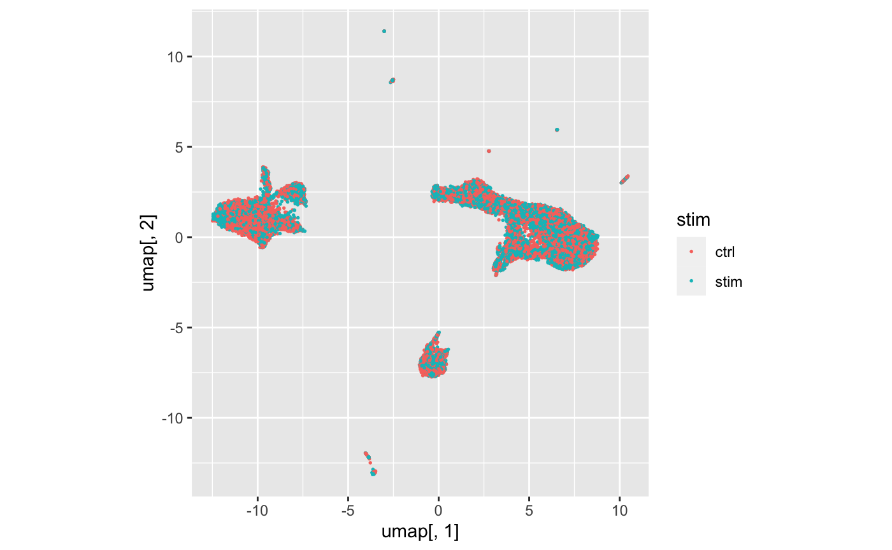
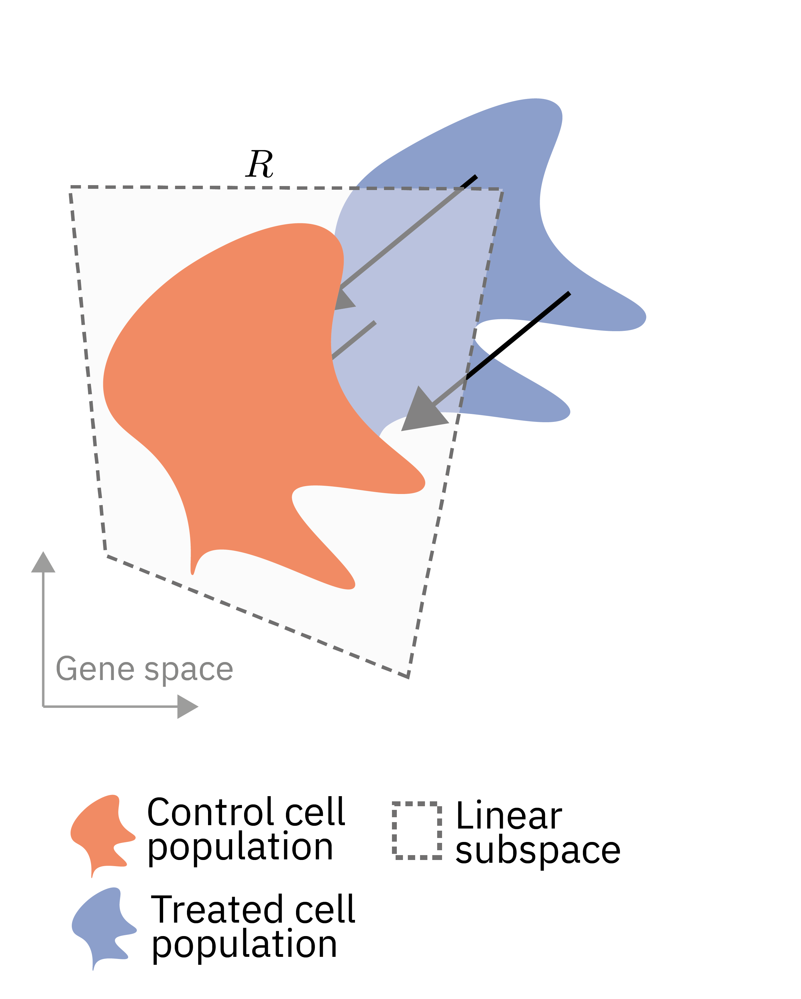
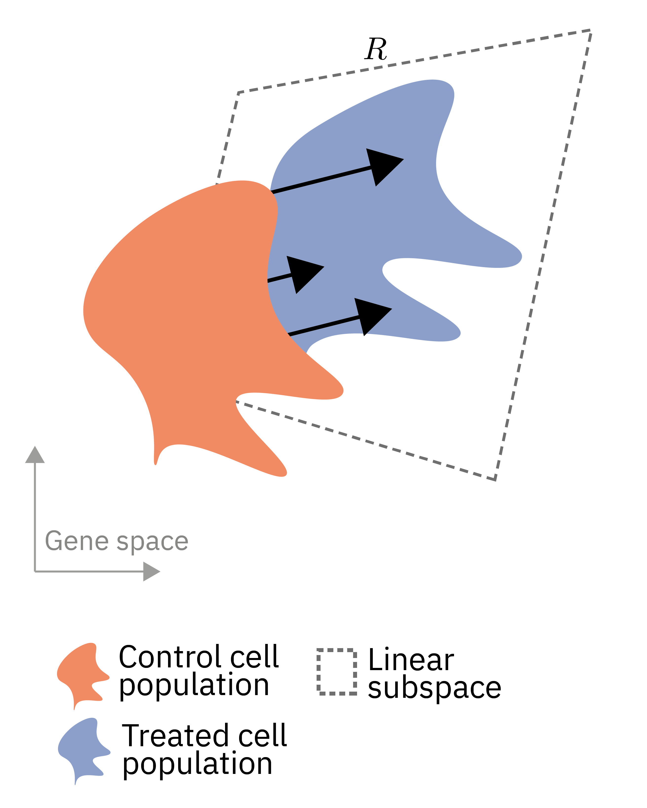
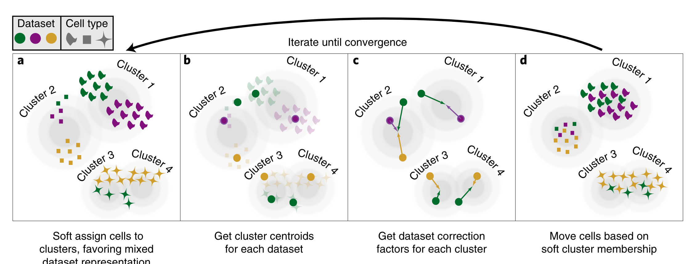
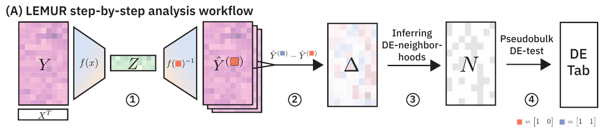
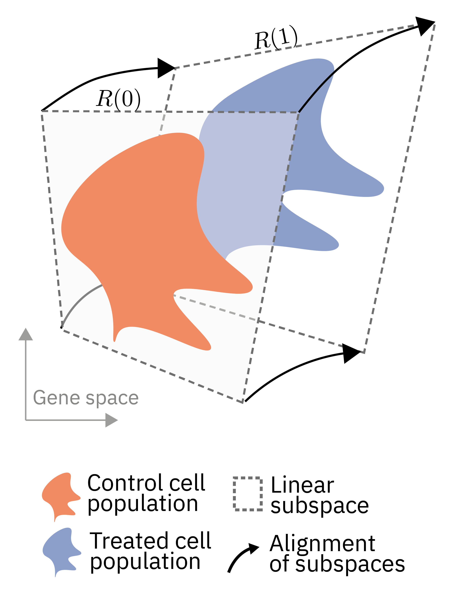
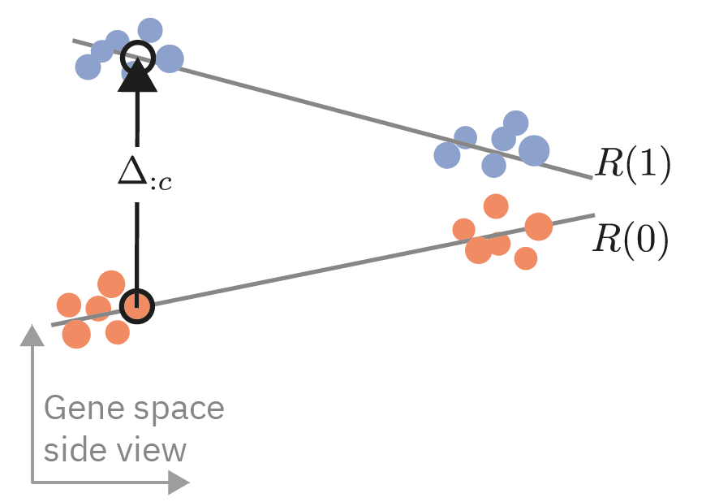
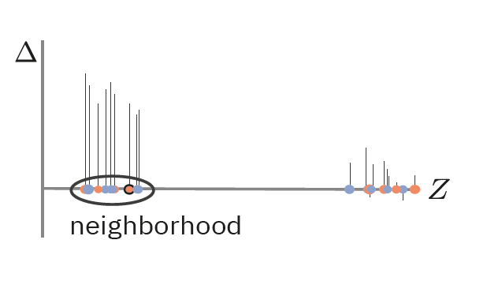

# What you will learn in this lab

Our objective is to compare single cell RNA-seq data from multiple, heterogeneous tissue samples across conditions. 
An obvious approach is to divide the constituent cells into clusters meant to represent cell types and, for each cluster separately, do "pseudo-bulk" differential expression with methods such as edgeR or DESEq2. 
However, such discrete categorization tends to be an unsatisfactory model of the
underlying biology. 
Here, we use latent embedding multivariate regression (LEMUR) (@AhlmannEltze:NatGen:2025), a model that operates without, or before, commitment to discrete categorization. 
LEMUR 

- integrates data from different conditions, 
- predicts each cell’s gene expression changes as a function
of the conditions and its position in latent space and
- for each gene, identifies a compact neighborhood of cells with consistent differential
expression. 


# Getting started

To start, we attach the `tidyverse` and `SingleCellExperiment` packages:

```{r}
#| label: initialize
#| echo: FALSE
knitr::opts_chunk$set(cache = TRUE, autodep = TRUE)
```

```{r}
#| label: load_packages
#| output: false
#| eval: !expr (! params$skip_execution)
#| echo: !expr 1:3
library("tidyverse")
library("SingleCellExperiment")
set.seed(1)
options(ggplot2.discrete.fill   = RColorBrewer::brewer.pal(9, "Set1"))
options(ggplot2.discrete.colour = RColorBrewer::brewer.pal(9, "Set1"))
```

::: {.column-margin}
The call to `set.seed`, to set the initial conditions ("seed") of R's random number generator, is optional. Here, it ensures that the results are exactly the same for everyone. Some of the methods here use stochastic sampling, but the expectation is that even with different random seeds, the results will be essentially the same. You can verify this by omiting the call to `set.seed` or calling it with a different argument.
:::

# Example data

We consider a dataset by @kang2018. The authors measured the effect of interferon-$\beta$ stimulation on blood cells from eight patients. The [`muscData`](https://bioconductor.org/packages/muscData/) package provides the data as a [`SingleCellExperiment`](https://bioconductor.org/books/release/OSCA.intro/the-singlecellexperiment-class.html). 
If downloading the data with the `muscData` package fails, you can also directly download the file from <http://oc.embl.de/index.php/s/tpbYcH5P9NfXeM5> and load it into R using `sce = readRDS("PATH_TO_THE_FILE")`.

```{r}
#| label: load_kang_data
#| eval: !expr (! isTRUE(params$skip_execution))
sce = muscData::Kang18_8vs8()
sce
```


::: {.callout-note collapse="true"}
## Question: How many genes and cells are in the data? How do you find the metadata about each cell / gene?

You can read about the number of genes and cells when printing the summary of the `sce`. Alternatively, you can use `nrow(sce)`, `ncol(sce)`, or `dim(sce)` to get these values.

In a `SingleCellExperiment` object, the metadata ("data about data") on the cells are accessed with `colData(sce)`, and those on the genes with `rowData(sce)`. 

Follow-up question: why does the documentation for `colData` (run `?colData` in the R console) talk about `SummarizedExperiment` objects instead of `SingleCellExperiment`?
:::

First, to visually explore the data, we logarithm transform them to account for the heteroskedasticity of the counts (@ahlmann-eltze2023), perform PCA to obtain for each cell a 50-dimensional, smoothed embedding vector, and then further call UMAP to map these vectors into a 2-dimensional representation for visualization on the screen. We use the [`scater`](https://bioconductor.org/packages/scater/) package, which adds a new slot called `logcounts` and the two slots `reducedDims(sce)` named `PCA` and `UMAP` to the `SummarizedExperiment` object. Equivalent functionality exists in `Seurat` and `scanpy`.

```{r}
#| label: kang_preprocess
#| eval: !expr (! params$skip_execution)
sce = scater::logNormCounts(sce)
hvg = order(MatrixGenerics::rowVars(logcounts(sce)), decreasing = TRUE)
sce = sce[hvg[1:500], ]
sce = scater::runPCA(sce, ncomponents = 50)
sce = scater::runUMAP(sce, dimred = "PCA")
```

::: {.callout-note collapse="true"}
## Question: How would you do a sctransform-like transformation (i.e., Pearson residuals) without using Seurat?

The [transformGamPoi](https://bioconductor.org/packages/release/bioc/vignettes/transformGamPoi/inst/doc/transformGamPoi.html) package from Bioconductor provides a `residual_transform` function.

```{r}
#| label: sctransform_alternative
#| eval: !expr (! params$skip_execution)
assay(sce, "pearson_residuals") = transformGamPoi::residual_transform(sce, residual = "pearson", on_disk = FALSE)
```
:::

::: {.callout-note collapse="true"}
## Question: What is the problem with using too few components for PCA? Is there also a problem with using too many?

Too few dimensions for PCA mean that it cannot capture enough of the relevant variation in the data. This leads to a loss of subtle differences between cell states.

Too many dimensions for PCA can also pose a problem. The objective of doing PCA with a number of components that is smaller than that of the original data, is to smooth out the sampling noise in the data. If too many PCA components are included, the smoothing is too weak, and the additional dimensions capture noise that can obscure biologically relevant differences. For more details see Fig. 2d in @ahlmann-eltze2023.
:::

::: {.callout-note collapse="true"}
## Challenge: How can you use tSNE instead of UMAP? What are alternative visualization methods?

The scater package also provides a `runTSNE` function

```{r}
#| label: run_tsne
#| eval: !expr (! params$skip_execution && ! params$skip_slow_chunks)
sce = scater::runTSNE(sce, dimred = "PCA")
```

On one hand, tSNE and UMAP are de facto standards for visualizing the cell type and state space in single cell data analysis. On the other hand, they are often criticized for failing to represent global structure and distorting differences in the data. A number of alternatives have been suggested, see e.g.:

- Force directed layout of the $k$ nearest neighbor (kNN) graph ([igraph](https://igraph.org/r/doc/layout_with_fr.html)),
- [PHATE](https://github.com/KrishnaswamyLab/PHATE)
- [IVIS](https://bering-ivis.readthedocs.io/en/latest/index.html)
- Unification of tSNE and UMAP using contrastive learning ([Böhm, 2023](https://arxiv.org/pdf/2210.09879.pdf))
:::

In the below two UMAP plots, the cells' positions strongly separate by treatment status (`stim`), as well as by annotated cell type (`cell`). One goal of this tutorial is to understand how different approaches use these covariates to integrate the data into shared embedding spaces or representations.

::: {.column-margin}
In this tutorial, we use direct calls to functions in the `ggplot2` package to visualize our data. This is a little more verbose than calling higher-level, specialized wrapper functions (e.g., `scater::plotReducedDim(sce, "UMAP", color_by = "stim")`), on the other hand, you see more directly what is going on.
:::

```{r}
#| label: fig-kang-umap
#| fig-cap: UMAP of log transformed counts
#| eval: !expr (! params$skip_execution)
as_tibble(colData(sce)) |>
  mutate(umap = reducedDim(sce, "UMAP")) |>
  ggplot(aes(x = umap[, 1], y = umap[, 2])) + 
    geom_point(aes(color = stim), size = 0.3) +
    coord_fixed()
```

::: {.callout-note collapse="true"}
## Question: The `colData(sce)$ind` column lists the patient identifier for each cell. Can you use this to create a separate plot for each patient?

One solution could be to use a `for` loop and filter the data for each patient, but there is a much simpler solution! Adding [facet_wrap()](https://ggplot2.tidyverse.org/reference/facet_wrap.html) to the ggplot call will automatically create a subpanel for each patient:

```{r}
#| label: fig-kang-umap_facetted
#| eval: !expr (! params$skip_execution)
as_tibble(colData(sce)) |>
  mutate(umap = reducedDim(sce, "UMAP")) |>
  ggplot(aes(x = umap[, 1], y = umap[, 2])) + geom_point(aes(color = stim), size = 0.3) + coord_fixed() +
    facet_wrap(vars(ind), ncol = 4)
```
:::

::: {.callout-note collapse="true"}
## Question: Why do we use `coord_fixed()` in the above plots?
Dimension reduction methods such as UMAP put in considerable effort to approximate the distance relationships between the points by arranging them in the Euclidean 2D plane, so it would be a shame to distort this by incidental figure size settings and by distinct scalings of the $x$- and the $y$-axis. 
:::

This dataset already comes with cell type annotations. The cell type labels help interpret the results; however, for the purpose of this tutorial, we will not need them and, besides @fig-kang-umap2, will ignore them.

```{r}
#| label: fig-kang-umap2
#| fig-cap: Cell type labels
#| eval: !expr (! params$skip_execution)
#| warning: false
#| fig-dim: !expr 10 * c(1, 1)
centroids = as_tibble(colData(sce)) |>
  mutate(umap = reducedDim(sce, "UMAP")) |>
  summarize(umap = matrix(colMedians(umap), nrow = 1), .by = c(stim, cell))

# Use `geom_text_repel` to avoid overlapping annotations
as_tibble(colData(sce)) |>
  mutate(umap = reducedDim(sce, "UMAP")) |>
  ggplot(aes(x = umap[, 1], y = umap[, 2])) +
    geom_point(aes(color = paste(stim, cell)), size = 0.3) +
    ggrepel::geom_text_repel(data = centroids, aes(label = paste(stim, cell))) +
    coord_fixed()
```

::: {.callout-note collapse="true"}
## Alternative path: Do the preprocessing with Seurat (click to see results)

The following code is based on the Seurat [*Guided Clustering Tutorial*](https://satijalab.org/seurat/archive/v3.0/pbmc3k_tutorial.html).

```{r}
#| label: seurat-preprocessing
#| eval: !expr (! params$skip_execution && ! params$skip_answers && ! params$skip_seurat)
# For more information about the conversion see `?as.Seurat.CellDataSet`
seur_obj = Seurat::as.Seurat(muscData::Kang18_8vs8(), data = NULL)
seur_obj = Seurat::NormalizeData(seur_obj, normalization.method = "LogNormalize", scale.factor = 10000)
seur_obj = Seurat::FindVariableFeatures(seur_obj, selection.method = "vst", nfeatures = 500)
# Subset to highly variable genes for memory efficiency
seur_obj = seur_obj[Seurat::VariableFeatures(object = seur_obj),]
seur_obj = Seurat::ScaleData(seur_obj)
seur_obj = Seurat::RunPCA(seur_obj, verbose = FALSE)
seur_obj = Seurat::RunUMAP(seur_obj, dims = 1:10)
```

```{r}
#| label: fig-seurat-plot
#| fig-cap: "UMAP plot after preprocessing with Seurat"
#| eval: !expr (! params$skip_execution && !params$skip_answers  && ! params$skip_seurat)
Seurat::DimPlot(seur_obj, reduction = "umap", group.by = "stim")
```
:::

# A prelude on data integration

When we made @fig-kang-umap, we discussed that the cells' embedding locations separate strongly both by treatment status and cell type. For many analyses, we would like to overlay the corresponding cells from the stimulated condition with the cells from the control condition. For example, for cell type assignment, we might want to annotate both conditions together, irrespective of treatment. This aspiration is called **integration**. The goal is a mathematical representation (e.g., a low-dimensional embedding) of the cells where the treatment status does not visibly affect the positions overall, and all the visible variance represents different cell types. @fig-integrated_picture shows an example.

{#fig-integrated_picture}

There are many approaches to this end. The question is somewhat ill-defined and can be formalized into a mathematical algorithm in many different ways. @luecken2022 benchmarked several approaches. Here, we first show how to do an integration manually, then with `harmony`. Later we will compare both to `lemur`. If you are just interested in using `lemur`, you can skip ahead to @sec-analysis-with-lemur.

::: {.callout-note collapse="true"}
## Question: In this tutorial we will just look at plots to assess integration success. Why is that suboptimal? How can we do better?

A 2D embedding like UMAP or tSNE gives us a visual impression if variation that comes  from "uninteresting" covariates (here: treatment condition) is eliminated and variation that comes from covariates we care about is retained, but the results are not quantitative, which means we cannot objectively assess or compare the quality of the result.

One simple metric to measure integration success is to see how mixed the cells from the two conditions are. For example, we can count for each cell how many of its $k$ nearest neighbors come from the same condition and how many come from the other condition(s), and then look at the distribution of this fraction. For more, see @luecken2022.

Follow-up challenge: Write a function to calculate the mixing metric.

Follow-up questions: Can you write an integration function that scores perfectly on this mixing metric? Hint: it can be biologically completely useless. What else would you need to measure to protect against such silly solutions?
:::


## Manual Projection

{#fig-ctrl-proj width="40%"}

In transcriptomic data analysis, each cell is characterized by its gene expression profile, which here we operationalize as the vector of counts for the 500 most variable genes. Accordingly, each cell is a point in a 500-dimensional _gene expression space_. Principal component analysis (PCA) finds a $P$-dimensional space ($P\le500$) such that overall, distance relationships between cells in the original space are optimally approximated by those in the reduced, $P$-dimensional space. 

::: {.column-margin}
Although there are over 20,000 genes in the human genome, the sensitivity of the assay that was used for our dataset is such that only a much smaller number of genes are well-measured, i.e., have counts high enough to be informative. Whether we use the top 500 genes by mean or by standard deviation makes no big difference. 
:::

To make these concepts more tangible, consider the cartoon in @fig-ctrl-proj. The orange blob represents an optimal two-dimensional embedding of all cells from the control condition. Similarly, the blue blob represents the treated cells. Each blob is contained within a two-dimensional subspace (plane) of the ambient space, but in general, these are different. 
To integrate both conditions, we can map the two planes into each other, so that each point from the blue blob is mapped into the orange subspace, and vice versa.

We can implement this procedure in a few lines of R code:

1. We create a matrix for the cells from the control and treated conditions,
2. we fit PCA on the control cells,
3. we center the data, and finally
4. we project the cells from both conditions onto the subspace of the control condition

```{r}
#| label: manual-proj
#| eval: !expr (! params$skip_execution)
# Each column from the matrix is the coordinate of a cell in the 500-dimensional space
ctrl_mat = as.matrix(logcounts(sce)[,sce$stim == "ctrl"])
stim_mat = as.matrix(logcounts(sce)[,sce$stim == "stim"])

ctrl_centers = rowMeans(ctrl_mat)
stim_centers = rowMeans(stim_mat)

# `prcomp` is R's name for PCA and IRLBA is an algorithm to calculate it.
ctrl_pca = irlba::prcomp_irlba(t(ctrl_mat - ctrl_centers), n = 20)

# With a little bit of linear algebra, we project the points onto the subspace of the control cells
integrated_mat = matrix(NA, nrow = 20, ncol = ncol(sce))
integrated_mat[,sce$stim == "ctrl"] = t(ctrl_pca$rotation) %*% (ctrl_mat - ctrl_centers)
integrated_mat[,sce$stim == "stim"] = t(ctrl_pca$rotation) %*% (stim_mat - stim_centers)
```

We check how successful we were by looking at a UMAP of the integrated embedding. 

```{r}
#| label: fig-manual-umap
#| fig-cap: UMAP of log transformed counts
#| collapse: true
#| eval: !expr (! params$skip_execution)

int_mat_umap = uwot::umap(t(integrated_mat))

as_tibble(colData(sce)) |>
  mutate(umap = int_mat_umap) |>
  ggplot(aes(x = umap[, 1], y = umap[, 2])) +
    geom_point(aes(color = stim), size = 0.3) +
    coord_fixed()
```

The overlap is not perfect, but better than in @fig-kang-umap.

::: {.callout-note collapse="true"}
## Challenge: What happens if you project on the `"stim"` subspace instead?

{width="40%"}

The projection is orthogonal onto the subspace, which means it matters which condition is chosen as reference.

```{r}
#| label: rev-manual-proj
#| eval: !expr (! params$skip_execution && ! params$skip_answers)
stim_pca = irlba::prcomp_irlba(t(stim_mat - stim_centers), n = 20, center = FALSE)

integrated_mat2 = matrix(NA, nrow = 20, ncol = ncol(sce))
integrated_mat2[,sce$stim == "ctrl"] = t(stim_pca$rotation) %*% (ctrl_mat - ctrl_centers)
integrated_mat2[,sce$stim == "stim"] = t(stim_pca$rotation) %*% (stim_mat - stim_centers)

int_mat_umap2 = uwot::umap(t(integrated_mat2))

as_tibble(colData(sce)) |>
  mutate(umap = int_mat_umap2) |>
  ggplot(aes(x = umap[, 1], y = umap[, 2])) +
    geom_point(aes(color = stim), size = 0.3) +
    coord_fixed()
```

For this example, using the `"stim"` condition as the reference leads to a worse integration.
:::

::: {.callout-warning collapse="true"}
## Brain teaser: How can you make the manual projection approach work for any complex experimental designs?

The projection approach consists of three steps:

1.  Centering the data (e.g., `ctrl_mat - ctrl_centers`).
2.  Choosing a reference condition and calculating the subspace that approximates the data from the reference condition (`irlba::prcomp_irlba(t(stim_mat - stim_centers))$rotation`).
3.  Projecting the data from the other conditions onto that subspace (`t(ctrl_pca$rotation) %*% (stim_mat - stim_centers)`).

For arbitrary experimental designs, we can perform the centering with a linear model fit. The second step remains the same. And after calculating the centered matrix, the third step is also straight forward. Below are the outlines how such a general procedure would work.

```{r}
#| label: challenge-complex-manual-adjustment
#| eval: false
# A complex experimental design
lm_fit = lm(t(logcounts(sce)) ~ condition + batch, data = colData(sce))
# The `residuals` function returns the coordinates minus the mean at the condition.
centered_mat = t(residuals(lm_fit))
# Assuming that `is_reference_condition` contains a selection of the cells
ref_pca = irlba::prcomp_irlba(centered_mat[,is_reference_condition], ...)
int_mat = t(ref_pca$rotation) %*% centered_mat
```
:::

## Harmony

Harmony is one popular tool for data integration [@korsunsky2019]. Harmony is relatively fast and can handle more complex experimental designs than just a treatment/control setup. It is built around _maximum diversity clustering_ (@fig-harmony_schematic). Unlike classical clustering algorithms, maximum diversity clustering not just minimizes the distance of each data point to a cluster center but also maximizes the mixing of conditions assigned to each cluster.

{#fig-harmony_schematic}

```{r}
#| label: harmony_integration
#| eval: !expr (! params$skip_execution)
#| message: false
#| echo: !expr -1
stopifnot(packageVersion("harmony") >= "1.0.0")
harm_mat = harmony::RunHarmony(reducedDim(sce, "PCA"), colData(sce), vars_use = c("stim"))
harm_umap = uwot::umap(harm_mat)

as_tibble(colData(sce)) |>
  mutate(umap = harm_umap) |>
  ggplot(aes(x = umap[, 1], y = umap[, 2])) +
    geom_point(aes(color = stim), size = 0.3) +
    coord_fixed()
```

::: {.callout-note}
## Challenge: How much do the results change if you change the default parameters in Harmony?
:::

::: {.callout-note collapse="true"}
## Challenge: How do you do integration in Seurat?

The integration method of Seurat is based on mutual nearest neighbors (MNN) by @haghverdi2018. However, Seurat calls the mutual nearest neighbors _integration anchors_. The main difference is that Seurat uses canonical correspondence analysis (CCA) instead of principal component analysis (PCA) for dimensionality reduction [@butler2018].

```{r}
#| label: fig-seurat_integration
#| fig-caption: "Seurat anchor integration"
#| eval: !expr (! params$skip_execution && ! params$skip_slow_chunks)

# This code only works with Seurat v5!
seur_obj2 = Seurat::as.Seurat(muscData::Kang18_8vs8(), data = NULL)
seur_obj2[["originalexp"]] = split(seur_obj2[["originalexp"]], f = seur_obj2$stim)
seur_obj2 = Seurat::NormalizeData(seur_obj2, normalization.method = "LogNormalize", scale.factor = 10000)
seur_obj2 = Seurat::FindVariableFeatures(seur_obj2, selection.method = "vst", nfeatures = 500)
seur_obj2 = Seurat::ScaleData(seur_obj2)
seur_obj2 = Seurat::RunPCA(seur_obj2, verbose = FALSE)

seur_obj2 = Seurat::IntegrateLayers(object = seur_obj2, method = Seurat::CCAIntegration, orig.reduction = "pca", new.reduction = "integrated.cca", verbose = FALSE)
seur_obj2 = Seurat::RunUMAP(seur_obj2, dims = 1:30, reduction = "integrated.cca")
Seurat::DimPlot(seur_obj2, reduction = "umap", group.by = "stim")
```
:::

# Analysis with LEMUR {#sec-analysis-with-lemur}

{#fig-lemur-workflow width="100%"}

LEMUR is a tool to analyze multi-condition single-cell data. A typical analysis workflow with LEMUR goes through four steps (@fig-lemur-workflow):

1. Covariate-adjusted dimensionality reduction.
2. Prediction of the differential expression for each cell per gene.
3. Identification of neighborhoods of cells with similar differential expression patterns.
4. Pseudobulked differential expression testing per neighborhood.

These are implemented by the following code.

```{r}
#| label: lemur-workflow
#| eval: false
#| message: false
library("lemur")
# Step 1
fit = lemur(sce, design = ~ stim, n_embedding = 30)
fit = align_by_grouping(fit, fit$colData$cell)

# Step 2
fit = test_de(fit, contrast = cond(stim = "stim") - cond(stim = "ctrl"))

# Steps 3 and 4
nei = find_de_neighborhoods(fit, group_by = vars(ind, stim))
```

In the next sections we discuss these steps in more detail.

## LEMUR Integration (Step 1)

Tools like MNN and Harmony take a PCA embedding and remove the effects of the specified covariates. However, there is no way to go back from the integrated embedding to the original gene space. This means that we cannot ask the counterfactual what the expression of a cell from the control condition would have been, had it been treated.

[`lemur`](https://bioconductor.org/packages/lemur/) achieves such counterfactuals by matching the subspaces of each condition [@AhlmannEltze:NatGen:2025]. @fig-subspace_matching illustrates the principle. In some sense this is a more sophisticated version of the manual matching that we saw in the previous section. The matching is a single affine transformation in contrast to shifts per cluster inferred by Harmony.

{#fig-subspace_matching width="40%"}

`lemur` takes as input a `SingleCellExperiment` object, the specification of the experimental design, and the number of latent dimensions. To refine the embedding, we call `align_by_grouping` and tell it to use the provided cell type annotations.

```{r}
#| label: fit-lemur-model
#| eval: !expr (! params$skip_execution)
#| message: false
library("lemur")
fit = lemur(sce, design = ~ stim, n_embedding = 30, verbose = FALSE)
fit = align_by_grouping(fit, fit$colData$cell, verbose = FALSE)
```

Making a UMAP plot of the embedding by `lemur` shows that it successfully integrated the conditions (@fig-lemur_umap).

```{r}
#| label: fig-lemur_umap
#| fig-cap: "UMAP plot of LEMUR embedding."
#| eval: !expr (! params$skip_execution)
lemur_umap = uwot::umap(t(fit$embedding))

as_tibble(colData(sce)) |>
  mutate(umap = lemur_umap) |>
  ggplot(aes(x = umap[, 1], y = umap[, 2])) +
    geom_point(aes(color = stim), size = 0.3) + coord_fixed()
```

We can cross-check our embedding with the provided cell type annotations by coloring each cell by cell type (using the information stored in the `colData(sce)$cell` column).
```{r}
#| label: fig-lemur-umap-celltypes
#| fig-cap: "Cell from the same cell types are close together after the integration"
#| eval: !expr (! params$skip_execution)
as_tibble(colData(sce)) |>
  mutate(umap = lemur_umap) |>
  ggplot(aes(x = umap[, 1], y = umap[, 2])) +
    geom_point(aes(color = cell), size = 0.3) + coord_fixed()
```

::: {.callout-note}
## Challenge: How much do the results change if you change the default parameters in `lemur`?
:::

::: {.callout-note collapse="true"}
## Challenge: How to can the embedding of `lemur` be refined with an automated tool?

If there are no cell type labels present, `lemur` uses a modified version of the maximum diversity clustering of `harmony` to automatically infer the cell relationships across conditions.

```{r}
#| label: align-lemur-model
#| eval: !expr (! params$skip_execution & ! params$skip_answers)
fit2 = lemur(sce, design = ~ stim, n_embedding = 30, verbose = FALSE)
fit2 = align_harmony(fit2, verbose = FALSE)
```
:::

## Differential expression analysis (Step 2)

The advantage of the `lemur` integration is that we can predict what the expression profile of a cell from the control condition would have been, had it been stimulated, and vice versa. Contrasting those predictions tells us how much the gene expression changes for that cell in any gene.

{width="60%"}

We call the `test_de` function of `lemur` to compare the expression values in the `"stim"` and `"ctrl"` conditions.
```{r}
#| label: lemur-calc-de
#| eval: !expr (! params$skip_execution)
fit = test_de(fit, contrast = cond(stim = "stim") - cond(stim = "ctrl"))
```

We can now pick an individual gene (_PLSCR1_) and plot the predicted log fold change for each cell to show how it varies as a function of the underlying gene expression values (@fig-lemur_plot_de-1).

```{r}
#| label: fig-lemur_plot_de
#| layout-ncol: 2
#| fig-cap: 
#|   - "Expression of _PLSCR1_ in control and stim condition"
#|   - "Counterfactual: `lemur` predicts _PLSCR1_ differential expression between control and stimulus for each cell"
#| eval: !expr (! params$skip_execution)
as_tibble(colData(sce)) |>
  mutate(umap = lemur_umap) |>
  mutate(expr = logcounts(fit)["PLSCR1",]) |>
  ggplot(aes(x = umap[, 1], y = umap[, 2])) +
    geom_point(aes(color = expr), size = 0.3) +
    scale_color_viridis_c() +
    facet_wrap(vars(stim)) +
    coord_fixed()

as_tibble(colData(sce)) |>
  mutate(umap = lemur_umap) |>
  mutate(de = assay(fit, "DE")["PLSCR1",]) |>
  ggplot(aes(x = umap[, 1], y = umap[, 2])) +
    geom_point(aes(color = de), size = 0.3) +
    scale_color_gradient2(low = scales::muted("blue"), high = scales::muted("red")) +
    coord_fixed()
```

This approach has the advantage over the traditional cluster/cell type-based analysis that it can detect smooth differential expression gradients.

::: {.callout-note collapse="true"}
## Challenge: Calculate the differential expression for each cell type using [glmGamPoi](https://bioconductor.org/packages/release/bioc/vignettes/glmGamPoi/inst/doc/pseudobulk.html).

`glmGamPoi` is a differential expression tool inspired by `edgeR` and `DESeq2` that is specifically designed for single cell RNA-seq data.

```{r}
#| label: glmGamPoi_de_test
#| eval: !expr (! params$skip_execution)
psce = glmGamPoi::pseudobulk(fit, group_by = vars(cell, ind, stim))
# Filter out NAs
psce = psce[,! is.na(psce$cell)]
glm_fit = glmGamPoi::glm_gp(psce, design = ~ stim * cell)
glm_de = glmGamPoi::test_de(glm_fit, contrast = cond(stim = "stim", cell = "B cells") - cond(stim = "ctrl", cell = "B cells"))
glm_de |>
  arrange(pval) |>
  head()
```
:::

::: {.callout-note collapse="true"}
## Challenge: For each cell type compare the `lemur` predictions against the observed expression of a gene:

We use the `pseudobulk` function from `glmGamPoi` to calculate the average expression and latent embedding position per condition and cell type. The mean embedding and `colData` is then fed to the `predict` function of `lemur`.

```{r, paged.print=FALSE}
#| label: glmGamPoi_vs_lemur2
#| eval: !expr (! params$skip_execution)

# You could choose any gene
gene_oi = "HERC5"

reduced_fit = glmGamPoi::pseudobulk(fit, group_by = vars(stim, cell))
lemur_pred_per_cell = predict(fit, newdata = colData(reduced_fit), embedding = t(reducedDim(reduced_fit, "embedding")))

as_tibble(colData(reduced_fit)) |>
  mutate(obs = logcounts(reduced_fit)[gene_oi,]) |>
  mutate(lemur_pred =  lemur_pred_per_cell[gene_oi,]) |>
  ggplot(aes(x = obs, y = lemur_pred)) +
    geom_abline() +
    geom_point(aes(color = stim)) +
    labs(title = "`lemur` predictions averaged per cell type and condition")
```
:::

## Neighborhood identification (Step 3) and differential expression tests (Step 4)

To help identify the most interesting changes, `lemur` can aggregate the results of each gene and identify the neighborhood of cells with the most prominent coherent pattern of differential gene expression. To conduct a statistically valid differential expression test, `lemur` pseudobulks the counts for each replicate (here this is the patient).

The output is a `data.frame` with one row for each gene. The `neighborhood` column is a list column, where each element is a vector with the IDs of the cells that are inside the neighborhood. The other columns describe the significance of the expression change defined in the `test_de` call.

{width="40%"}

```{r, paged.print=FALSE}
#| label: find-neighborhood-lemur
#| eval: !expr (! params$skip_execution)
#| message: false
nei = find_de_neighborhoods(fit, group_by = vars(ind, stim))
head(nei)
```

We can sort the table either by the `pval` or the `did_pval`. The `pval` measures the evidence of an expression change between control and stimulated condition for all cells inside the neighborhood. In contrast, the `did_pval` measures how much larger the expression difference is for the cells inside the neighborhood versus outside.

```{r, paged.print=FALSE}
#| label: find-neighborhood-lemur-results
#| eval: !expr (! params$skip_execution)
slice_min(nei, pval, n = 3)

slice_min(nei, did_pval, n = 3)
```

```{r, paged.print=FALSE}
#| label: find-neighborhood-lemur-result-plots2
#| eval: !expr (! params$skip_execution)
top_did_gene = slice_min(nei, did_pval)

as_tibble(colData(sce), rownames = "cell_name") |>
  mutate(umap = lemur_umap) |>
  mutate(de = assay(fit, "DE")[top_did_gene$name,]) |>
  ggplot(aes(x = umap[, 1], y = umap[, 2])) +
    geom_point(aes(color = de), size = 0.3) +
    scale_color_gradient2(low = scales::muted("blue"), high = scales::muted("red")) +
    coord_fixed() +
    labs(title = "Top differentially expressed gene, by did_pval")
```

As you can see in the above plot, there is strong differential expression of this gene in one cluster of cells, and essentially none in the other cells.

To see which cells `lemur` included in the neighborhood for each gene, we will first make a smaller helper function:

```{r}
#| label: neighborhoods_to_long_dataframe-helper-function-1
#| eval: !expr (! params$skip_execution)
#| echo: false
neighborhoods_to_long_dataframe_old = function(data, fit = NULL){
  nei = data[["neighborhood"]]
  gene_names = data[["name"]]
  cell_names = if(! is.null(fit)) colnames(fit) else unique(unlist(nei))
  levels2idx = seq_along(cell_names)
  names(levels2idx) = cell_names
  res = list(
    rep(gene_names, each = length(cell_names)),
    rep(cell_names, times = length(gene_names)),
    rep(FALSE, length(cell_names) * length(gene_names))
  )
  offset = 0
  for(n in nei){
    res[[3]][offset + levels2idx[n]] = TRUE
    offset = offset + length(cell_names)
  }

  names(res) = c("name", "cell", "inside")
  tibble::as_tibble(res)
}
```

```{r}
#| label: neighborhoods_to_long_dataframe-helper-function-2
#| eval: !expr (! params$skip_execution)
neighborhoods_to_long_dataframe = function(x, fit) {
  nei = x[["neighborhood"]] 
  gene_names = x[["name"]]
  cell_names = unique(unlist(nei))  
  if (!missing(fit)) cell_names = union(cell_names, colnames(fit))
  stopifnot(!is.null(nei), !is.null(gene_names), !is.null(cell_names))
  
  res = matrix(FALSE, nrow = length(cell_names), ncol = length(gene_names),
               dimnames = list(cell = cell_names, name = gene_names))
  for (i in seq_along(gene_names))
    res[nei[[i]], gene_names[i]] = TRUE
  
  as.data.frame.table(res, responseName = "inside", stringsAsFactors = FALSE) |> as_tibble()
}
```

```{r}
#| label: neighborhoods_to_long_dataframe-helper-function-3
#| eval: !expr (! params$skip_execution)
#| echo: false
.testdata = slice_min(nei, pval, n = 27)
.res1 = neighborhoods_to_long_dataframe_old(.testdata, fit)
.res2 = neighborhoods_to_long_dataframe(    .testdata, fit) 
stopifnot(
  setequal(colnames(.res1), colnames(.res2)), 
  nrow(.res1) == nrow(.res2),
  # need to do it like this since rows come in different order...
  identical(
    sort(with(.res1, paste(name, cell, inside))), 
    sort(with(.res2, paste(name, cell, inside)))
  )
)
```

With this function, we can annotate for any gene if a cell is included in its `lemur` neighborhood.

```{r, paged.print=FALSE}
#| label: neighborhood-facetted
#| eval: !expr (! params$skip_execution)
cells_inside_df = neighborhoods_to_long_dataframe(top_did_gene, fit)

as_tibble(colData(sce), rownames = "cell_name") |>
  mutate(umap = lemur_umap) |>
  mutate(de = assay(fit, "DE")[top_did_gene$name,]) |>
  left_join(cells_inside_df, by = c("cell_name" = "cell")) |>
  ggplot(aes(x = umap[, 1], y = umap[, 2])) +
    geom_point(aes(color = de), size = 0.3) +
    scale_color_gradient2(low = scales::muted("blue"), high = scales::muted("red")) +
    coord_fixed() +
    facet_wrap(vars(inside), labeller = label_both) +
    labs(title = "Top differentially expressed gene, according to did_pval")
```

::: {.callout-warning collapse="true"}
## Brain teaser: How are `lemur` neighborhoods different from the cluster-based differential expression tests?

The `lemur` neighborhoods are adaptive to the underlying expression patterns for each gene. This means that they provide optimal power to detect differential expression as well the set of cells for which the gene expression changes most.

The plot below illustrates this for the top three DE genes by `pval` which all have very different neighborhoods. Note that the neighborhoods are convex in the low-dimensional embedding space, even though in the UMAP embedding they might not look like it. This is due to the non-linear nature of the UMAP dimensionality reduction.

```{r, paged.print=FALSE}
#| label: neighborhood-facetted-top3
#| eval: !expr (! params$skip_execution)
cells_inside_df_top3 = neighborhoods_to_long_dataframe(slice_min(nei, pval, n = 3), fit)

as_tibble(colData(sce), rownames = "cell_name") |>
  mutate(umap = lemur_umap) |>
  mutate(de = as_tibble(t(assay(fit, "DE")[slice_min(nei, pval, n = 3)$name,]))) |>
  unpack(de, names_sep = "_") %>%
  pivot_longer(starts_with("de_"), names_sep = "_", names_to = c(".value", "gene_name")) |>
  left_join(cells_inside_df_top3, by = c("gene_name" = "name", "cell_name" = "cell")) |>
  ggplot(aes(x = umap[, 1], y = umap[, 2])) +
    geom_point(aes(color = de), size = 0.3) +
    scale_color_gradient2(low = scales::muted("blue"), high = scales::muted("red")) +
    coord_fixed() +
    facet_grid(vars(inside), vars(gene_name), labeller = label_both) +
    labs(title = "Top 3 DE gene by pval")
```
:::


# Outlook

`lemur` can handle arbitrary design matrices as input, which means that it can also handle more complicated experiments than the simple treatment / control comparison shown here. Just as with `limma`, `edgeR` or `DESeq2`, you can model

- multiple covariates, e.g., the treatment of interest as well as known confounders (experiment batch, sex, age) or blocking variables,
- interactions, e.g., drug treatment in wild type and mutant,
- continuous covariates, e.g., time courses, whose effects can also be modeled using smooth non-linear functions (spline regression). 

For more details, see @AhlmannEltze:NatGen:2025. For any questions, whether technical/practical or conceptual, please post to the [Bioconductor forum](https://support.bioconductor.org/) using the `lemur` tag and follow the [posting guide]( https://bioconductor.org/help/support/posting-guide/).


# Session Info

```{r}
sessionInfo()
```


