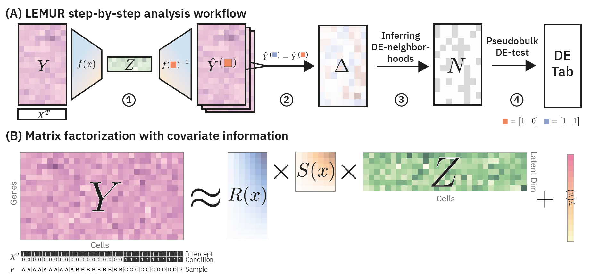

# What you will learn in this lab

Our objective is to compare single cell RNA-seq data from multiple tissue samples across conditions. 
An obvious approach is to divide the constituent cells into clusters meant to represent cell types and, for each cluster separately, do pseudo-bulk differential expression with methods such as edgeR or DESEq2. t 
However, such discrete categorization tends to be an unsatisfactory model of the underlying biology. 

Here, we use _latent embedding multivariate regression_ (LEMUR) (@AhlmannEltze:NatGen:2025), a model that operates without or before commitment to discrete cell type categorization. 
LEMUR fits a regression model that _predicts_ for each cell the expression of its genes in each of the conditions.
Note that for any given cell, the expression of its genes was only _observed_ in one replicate of one condition.
The predictions enable us to compute any _contrast_^[the technical term for differential expression effects] of interest, such as: how would the expression of a certain gene in a particular cell differ between treatment and control condition? It even lets us inter- and extrapolate between conditions, or consider more complex experimental designs such as factorial analysis, blocking factors, or continuous covariates. Given such contrasts, we can do _biclustering_ to find groups of genes that behave similarly across a group of cells. Such a group of genes may then be interpreted in terms of pathways or a coordinated gene programme. Groups of cells is not necessarily associated to a single cell type, but also combinations of several cell types, or subsets within cell types.



# Getting started

To start, we attach the `tidyverse` and `SingleCellExperiment` packages:

```{r}
#| label: initialize
#| echo: false
knitr::opts_chunk$set(cache = TRUE, autodep = TRUE)
options(ggplot2.discrete.fill   = RColorBrewer::brewer.pal(9, "Set1"))
options(ggplot2.discrete.colour = RColorBrewer::brewer.pal(9, "Set1"))
```

```{r}
#| label: load_packages
#| output: false
#| echo: true
library("tidyverse")
library("SingleCellExperiment")
set.seed(0xbebe)
```

::: {.column-margin}
`set.seed` sets the initial conditions ("seed") of R's random number generator. This step is optional. Here, it ensures that the results are exactly the same for everyone. Some of the methods here use stochastic sampling, but the expectation is that even with different random seeds, the essence of the results will be the same. You can verify this by omiting the call to `set.seed` or calling it with a different argument.
:::

# Example data

We consider a dataset by @kang2018. The authors measured the effect of interferon-$\beta$ stimulation on blood cells from eight patients. The [`muscData`](https://bioconductor.org/packages/muscData/) package provides the data as a [`SingleCellExperiment`](https://bioconductor.org/books/release/OSCA.intro/the-singlecellexperiment-class.html). 
If downloading the data with the `muscData` package fails, you can also directly download the file from <http://oc.embl.de/index.php/s/tpbYcH5P9NfXeM5> and load it into R using `sce = readRDS("PATH_TO_THE_FILE")`.

```{r}
#| label: load_kang_data
sce <- muscData::Kang18_8vs8()
sce
```

::: {.callout-note collapse="true"}
## Question: How many genes and cells are in the data? How do you find the metadata about each cell / gene?

The numbers of genes and cells are mentioned when printing the summary of the `sce`. Alternatively, you can use `nrow(sce)`, `ncol(sce)`, or `dim(sce)` to directly access these values.

In a `SingleCellExperiment` object, the metadata ("data about data") on the cells are accessed with `colData(sce)`, and those on the genes with `rowData(sce)`. 
The `SingleCellExperiment` class inherits from (extends) the `SummarizedExperiment` class, thus shares its methods, including `colData` and `rowData`.
:::

As always, we first visually explore the data. To this end, we logarithm transform them to account for the heteroskedasticity of the counts (@ahlmann-eltze2023), perform PCA to obtain for each cell a 50-dimensional vector (also known as an "embedding"), and then use UMAP to map these vectors into a two-dimensional plane for visualization on the screen. Here, we use the [`scrapper`](https://bioconductor.org/packages/scrapper/) package to compute a new slot called `logcounts`, and the [`scater`](https://bioconductor.org/packages/scater/) package to add the slot `reducedDims(sce)` with `PCA` and `UMAP` results. Equivalent functionality exists in other packages, e.g., in `Seurat` and `scanpy`.

```{r}
#| label: kang_preprocess
#| message: false
library("sparseMatrixStats")                # provides the rowVars method needed below
sce <- scrapper::normalizeRnaCounts.se(sce)
hvg <- order(MatrixGenerics::rowVars(logcounts(sce)), decreasing = TRUE)
sce <- sce[hvg[1:500], ]
sce <- scater::runPCA(sce, ncomponents = 50)
sce <- scater::runUMAP(sce, dimred = "PCA")
reducedDims(sce)
reducedDims(sce) |> sapply(class)
reducedDims(sce) |> sapply(dim)
```


In the below two UMAP plots, the cells' positions strongly separate by treatment status (`stim`), as well as by annotated cell type (`cell`). One goal of this tutorial is to understand how different approaches use these covariates to integrate the data into shared embedding spaces or representations.

::: {.column-margin}
In this tutorial, we use direct calls to functions in the `ggplot2` package to visualize our data. This is a little more verbose than calling higher-level, specialized wrapper functions (e.g., `scater::plotReducedDim(sce, "UMAP", color_by = "stim")`), on the other hand, you see more directly what is going on.
:::

```{r}
#| label: fig-kang-umap
#| fig-cap: UMAP of log transformed counts
#| fig-width: 5
#| fig-height: 5
#| layout-ncol: 2
ggum <- as_tibble(colData(sce)) |>
      mutate(umap = reducedDim(sce, "UMAP")) |>
        ggplot(aes(x = umap[, 1], y = umap[, 2])) + coord_fixed()

ggum + geom_point(aes(colour = stim), size = 0.3)
ggum + geom_point(aes(colour = cell), size = 0.3)   
```

::: {.callout-note collapse="true"}
## Question: The `colData(sce)$ind` column lists the patient identifier for each cell. Can you use this to create a separate plot for each patient?

One solution could be to use a `for` loop and filter the data for each patient, but there is a much simpler solution! Adding [`facet_wrap`](https://ggplot2.tidyverse.org/reference/facet_wrap.html) to the `ggplot` call will automatically create a subpanel for each patient:

```{r}
#| label: fig-kang-umap-facetted
#| fig-cap: Like @fig-kang-umap-1, but separately per patient ID
#| fig-width: 10
#| fig-height: 5
ggum + geom_point(aes(colour = stim), size = 0.3) + facet_wrap(vars(ind), ncol = 4)
```
:::

::: {.callout-note collapse="true"}
## Question: Why do we use `coord_fixed()` in the above plots?
Dimension reduction methods such as UMAP put in considerable effort to approximate the distance relationships between the points by arranging them in the Euclidean 2D plane, so it would be a shame to distort this by incidental figure size settings and by distinct scalings of the $x$- and the $y$-axis. 
:::

This dataset already comes with cell type annotations. These may help us later in interpreting the results. Note that the LEMUR analysis does **not** need them.

```{r}
#| label: fig-kang-umap-celltypelabels
#| fig-cap: Cell type labels
#| warning: false
#| fig-dim: !expr 10 * c(1, 1)
centroids <- as_tibble(colData(sce)) |>
  mutate(umap = reducedDim(sce, "UMAP")) |>
  summarize(umap = matrix(colMedians(umap), nrow = 1), .by = c(stim, cell))

# Use `geom_text_repel` to avoid overlapping annotations
ggum + geom_point(aes(colour = paste(stim, cell, sep = ": ")), size = 0.3) +
    ggrepel::geom_text_repel(data = centroids, aes(label = paste(stim, cell, sep = ": ")))
```


# LEMUR analysis {#sec-analysis-with-lemur}

{#fig-lemur-workflow width="100%"}

LEMUR is a tool to analyze multi-condition single-cell data. A typical analysis workflow with LEMUR goes through five steps (@fig-lemur-workflow):

1. Covariate-adjusted dimensionality reduction.
2. Prediction of the differential expression for each cell per gene.
3. Identification of groups (or: "neighbourhoods") of cells with similar differential expression patterns.
4. Pseudobulk differential expression testing per neighbourhood.
5. Biclustering of cells and genes with similar differential expression patterns

A basic workflow might look like this^[Future versions might simplify this into a single end-to-end function.]:
```{r}
#| label: lemur-workflow
#| eval: true
#| message: false
library("lemur")
fit <- lemur(sce, design = ~ stim, n_embedding = 30)  
fit <- align_by_grouping(fit, fit$colData$cell) |>
          test_de(contrast = cond(stim = "stim") - cond(stim = "ctrl"))
nei <- find_de_neighborhoods(fit, group_by = vars(ind, stim))
```

In the following, we go through each step in a little more detail.

## LEMUR Integration (Step 1)

Tools like MNN and Harmony take a PCA embedding and remove the effects of the specified covariates. You can learn more about them in the Appendix (@sec-appendix). However, the drawback is that there is no way to go back from the integrated embedding to the original gene space. This means that we cannot ask the counterfactual what the expression of a cell from the control condition would have been, had it been treated.

[LEMUR](https://bioconductor.org/packages/lemur) achieves such counterfactuals by matching the subspaces of each condition [@AhlmannEltze:NatGen:2025]. @fig-subspace_matching illustrates the principle. 

{#fig-subspace_matching width="40%"}

The `lemur` function takes as input a `SingleCellExperiment` object, the specification of the experimental design, and the number of latent dimensions. To refine the embedding, we call `align_by_grouping` and tell it to use the provided cell type annotations.

```{r}
#| label: fit-lemur-model
#| message: false
fit <- lemur(sce, design = ~ stim, n_embedding = 30, verbose = FALSE)
fit <- align_by_grouping(fit, fit$colData$cell, verbose = FALSE)
```

Making a UMAP plot of the embedding by `lemur` suggests successful integration of the conditions (@fig-lemur_umap)^[Note the line with `arrange` in the code below, which  randomly reorders the rows of the dataframe. This way, the inevitable overplotting in such UMAP plots does not favour data points that come later in the original dataframe.].

```{r}
#| label: fig-lemur_umap
#| fig-cap: "UMAP plot of LEMUR embedding."
lemur_umap <- uwot::umap(t(fit$embedding))

gglem <- as_tibble(colData(sce)) |>
  mutate(umap = lemur_umap) |>
  arrange(runif(length(stim))) |>
  ggplot(aes(x = umap[, 1], y = umap[, 2])) + coord_fixed()

gglem + geom_point(aes(colour = stim), size = 0.3) 
```

We can cross-check our embedding with the provided cell type annotations by colouring each cell by cell type (using the information stored in the `colData(sce)$cell` column).
```{r}
#| label: fig-lemur-umap-celltypes
#| fig-cap: "Cell from the same cell types are close together after the integration"
gglem + geom_point(aes(colour = cell), size = 0.3) 
```

::: {.callout-note collapse="true"}
## Challenge: How to can the embedding of `lemur` be refined with an automated tool?

If there are no cell type labels present, `lemur` uses a modified version of the maximum diversity clustering of `harmony` to automatically infer the cell relationships across conditions.  <span style="color:red;">Currently (`lemur 1.9`, May 2026), lemur needs [`harmony` version 1.2.4 or earlier](https://cran.r-project.org/src/contrib/Archive/harmony/), and does not work with version 2.x.x </span>. This is not great, and we hope to fix it.

```{r}
#| label: align-lemur-model
#| eval: !expr params$execute_align_harmony
fit2 <- lemur(sce, design = ~ stim, n_embedding = 30, verbose = FALSE)
# don't run:
# fit2 <- align_harmony(fit2, verbose = FALSE)
```
:::

## Differential expression analysis (Step 2)

An advantage of the LEMUR integration is that we can predict what the expression profile of a cell from the control condition would have been, had it been stimulated, and vice versa. Contrasting those predictions tells us how much the gene expression changes for that cell in any gene.

{width="60%"}

We call the `test_de` function of `lemur` to compare the expression values in the `stim` and `ctrl` conditions.
```{r}
#| label: lemur-calc-de
fit <- test_de(fit, contrast = cond(stim = "stim") - cond(stim = "ctrl"))
```

We can now pick an individual gene (_PLSCR1_) and plot the predicted log fold change for each cell to show how it varies as a function of the underlying gene expression values (@fig-lemur_plot_de-1). The code below defines a helper function `mysequentialcolourscale` to get a suitable colour scale: white corresponds to zero and blue to `maxval`.


```{r}
#| label: fig-lemur_plot_de-1
#| message: false
#| fig-cap: "Expression of _PLSCR1_ in control and stim condition"
#| fig-width: 7
#| fig-height: 3.5
mysequentialcolourscale <- function(maxval)
  scale_colour_continuous(
     limits = c(0, 1) * maxval,
     oob = scales::squish,
     palette = grDevices::colorRampPalette(RColorBrewer::brewer.pal(9, "Blues"))(256)
   )

ggplscr1 <- as_tibble(colData(sce)) |>
  mutate(
    umap = lemur_umap,
    expr = logcounts(fit)["PLSCR1", ],
    de   = assay(fit, "DE")["PLSCR1", ]
  ) |>
  ggplot(aes(x = umap[, 1], y = umap[, 2])) + coord_fixed()
  
 ggplscr1 + geom_point(aes(colour = expr), size = 0.2) + mysequentialcolourscale(4) +
    facet_wrap(vars(stim))
```

We set up another colour scale for showing log fold changes, with blue corresponding to `-maxval`, red to `+maxval` and an extended range of white in the middle (around 0).

```{r}
#| label: fig-lemur_plot_de-2
#| message: false
#| fig-cap: "Counterfactual: `lemur` predicts _PLSCR1_ differential expression between control and stimulus for each cell"
#| fig-width: 5
#| fig-height: 5
mydivergentcolourscale <- function(maxval)
  scale_colour_continuous(
     limits = c(-1, 1) * maxval,
     oob = scales::squish,
     palette = grDevices::colorRampPalette(RColorBrewer::brewer.pal(11, "RdBu")[rev(c(1:5, 6, 6, 6, 6, 7:11))])(256)
   )

ggplscr1 + geom_point(aes(colour = de), size = 0.2) + mydivergentcolourscale(1.5)   
```

## Find neighbourhoods (Step 3) and test for differential expression (Step 4)

As a step towards identifying the most differential expression patterns, `lemur` can screen the results of each gene to find a set of cells (which we call _neighbourhood_) with the most prominent coherent pattern of differential gene expression for that gene. Subsequently, to conduct statistically valid differential expression inference, `lemur` uses the pseudobulk approach to compute a gene count for each replicate (here: patient) on the test data that were previously set aside. The output is a `data.frame` with one row for each gene. The `neighborhood` column contains a list, where each list element is a vector with the IDs of the cells that are inside the neighbourhood. The other columns contain statistical measures of significance.

{width="40%"}

```{r}
#| label: find-neighbourhood-lemur
#| message: false
#| echo: !expr -1
.olddigits <- options("digits"); options(digits = 3)
nei <- find_de_neighborhoods(fit, group_by = vars(ind, stim))
head(nei)
```

We can sort the table either by `pval` or `did_pval`. The p value `pval` is from a test for expression change between control and stimulated condition for all cells inside the neighbourhood. The p value `did_pval` is from a test for expression difference between the cells inside versus outside the neighbourhood.

```{r}
#| label: find-neighbourhood-lemur-results
slice_min(nei, pval, n = 3)
slice_min(nei, did_pval, n = 3)
```

```{r}
#| label: fig-find-neighbourhood
top_did_gene <- slice_min(nei, did_pval)

as_tibble(colData(sce), rownames = "cell_name") |>
  mutate(umap = lemur_umap) |>
  mutate(de = assay(fit, "DE")[top_did_gene$name, ]) |>
  ggplot(aes(x = umap[, 1], y = umap[, 2])) +
    geom_point(aes(colour = de), size = 0.3) +
    mydivergentcolourscale(1) +
    coord_fixed() +
    labs(title = paste("The top differentially expressed gene by did_pval:", top_did_gene$name))
```

As you can see in the above plot, there is strong differential expression of this gene in one cluster of cells, and essentially none in the other cells.

To see which cells `lemur` included in the neighbourhood for each gene, we will first define a small helper function that converts `nei`---a  dataframe that contains one row per gene, and the neighbourhood of that gene as a vector of cell identifiers in the `neighborhood` columns--into another dataframe that has one row for each gene and for each cell, and a column `inside` with a logical variable that indicates whether this cell is in the neighbourhood for that gene.

::: {.column-margin}
Future versions of `lemur` may contain this functionality inside, so you dont need to worry about it.
:::

```{r}
#| label: neighbourhoods_to_adjacency_matrix
neighbourhoods_to_adjacency_matrix <- function(x, fit, out = c("matrix", "longdataframe")) {
  nei <- x[["neighborhood"]] 
  gene_names <- x[["name"]]
  cell_names <- unique(unlist(nei))  
  if (!missing(fit)) 
    cell_names <- union(cell_names, colnames(fit))
  stopifnot(!is.null(nei), !is.null(gene_names), !is.null(cell_names))
  
  mat <- matrix(0L, nrow = length(cell_names), ncol = length(gene_names),  # integer matrix cells x genes
                    dimnames = list(cell = cell_names, gene = gene_names))

  for (i in seq_along(gene_names))
    mat[nei[[i]], gene_names[i]] <- as.integer(sign(x$lfc[i]))
  
  switch(out,
    matrix = mat, # matrix of integers -1, 0, +1 of size cells x genes
    longdataframe = as_tibble(as.data.frame.table(mat != 0, responseName = "inside",
                              stringsAsFactors = FALSE))  # inside: column of logical
  )
}
```

With this function, we can annotate for any gene if a cell is included in its `lemur` neighbourhood.
Let's redo @fig-find-neighbourhood, but now separately for the cells inside and outside:

```{r}
#| label: neighbourhood-facetted
cells_inside_df <- neighbourhoods_to_adjacency_matrix(top_did_gene, fit, out = "longdataframe")

as_tibble(colData(sce), rownames = "cell_name") |>
  mutate(umap = lemur_umap) |>
  mutate(de = assay(fit, "DE")[top_did_gene$name,]) |>
  left_join(cells_inside_df, by = c("cell_name" = "cell")) |>
  ggplot(aes(x = umap[, 1], y = umap[, 2])) +
    geom_point(aes(colour = de), size = 0.3) +
    mydivergentcolourscale(1) +
    coord_fixed() +
    labs(title = paste("The top differentially expressed gene by did_pval:", top_did_gene$name)) +
    facet_wrap(vars(inside), labeller = label_both)
```

::: {.callout-warning collapse="true"}
## Brain teaser: How are `lemur` neighbourhoods different from the cluster-based differential expression tests?

The `lemur` neighbourhoods are adaptive to the underlying expression patterns for each gene. This means that they detect differential expression not just for a predefined set of cells, but for that set of cells for which the gene expression changes most consistently.

The plot below illustrates this for the top three DE genes by `pval`, which all have very different neighbourhoods. Note that the neighbourhoods are convex in the low-dimensional embedding space, even though in the UMAP embedding they might not look like it. This is due to the non-linear nature of the UMAP dimensionality reduction.

```{r}
#| label: neighbourhood-facetted-top3
cells_inside_df_top3 <- neighbourhoods_to_adjacency_matrix(slice_min(nei, pval, n = 3), fit, "longdataframe")

as_tibble(colData(sce), rownames = "cell_name") |>
  mutate(umap = lemur_umap) |>
  mutate(de = as_tibble(t(assay(fit, "DE")[slice_min(nei, pval, n = 3)$name,]))) |>
  unpack(de, names_sep = "_") |>
  pivot_longer(starts_with("de_"), names_sep = "_", names_to = c(".value", "gene_name")) |>
  left_join(cells_inside_df_top3, by = c("gene_name" = "gene", "cell_name" = "cell")) |>
  ggplot(aes(x = umap[, 1], y = umap[, 2])) +
    geom_point(aes(colour = de), size = 0.3) +
    mydivergentcolourscale(2) +
    coord_fixed() +
    facet_grid(vars(inside), vars(gene_name), labeller = label_both) +
    labs(title = "Top 3 DE genes by pval")
```
:::

## Step 5: Simultaneous clustering of genes and cells (biclustering)

So far, we have identified cell neighbourhoods for individual genes. While this is useful, the results for hundreds of genes can be overwhelming, and we may want to go a step further and know whether certain sets of genes have quite similar neighbourhoods, i.e., are co-differentially expressed. In this step, which was not yet described by @AhlmannEltze:NatGen:2025, we use biclustering to address this question.

### Clustering neighborhoods is not enough

As we already determined neighborhoods (i.e. subsets of cells) with coherent expression of a single gene, it seems only natural to further process these to identify superseeding neighborhoods, where the subset of cells shows coherent expression (or suppression) of multiple genes.

Indeed, taking the previously determined neighborhoods, we can easily quantify their similarity using a simple Jaccard index ($J(A,B) = \frac{|A \cap B|}{|A \cup B|}$).

```{r}
#| label: jaccard
top_gene <- slice_min(nei, did_pval, n = 1, with_ties = FALSE)
ref_cells <- top_gene$neighborhood[[1]]

# Function to compute Jaccard similarity
jaccard_index <- function(a, b) {
  a <- unique(a)
  b <- unique(b)
  if (length(a) == 0 && length(b) == 0) return(NA_real_)
  length(intersect(a, b)) / length(union(a, b))
}

jaccard_df <- nei |> filter(adj_pval < 0.15) |>
  mutate(
    jaccard = map_dbl(neighborhood, ~ jaccard_index(.x, ref_cells)),
    mean_expr_inside = map2_dbl(
      name,
      neighborhood,
      ~ mean(assay(fit, "DE")[.x, .y], na.rm = TRUE)
    )
  ) |>
  select(name, jaccard, mean_expr_inside) |>
  arrange(desc(jaccard))

head(jaccard_df, 10)

```

As we can see, many neighbourhoods show strong overlap, and the mean expression indicates that we find both up- and downregulated genes. Setting a threshold of, say, $J > 0.8$, we obtain:

```{r}
recruited <- jaccard_df |>
  filter(jaccard > 0.8) |>
  arrange(desc(jaccard))

recruited_genes <- recruited$name

recruited_neighborhoods <- nei |>
  filter(name %in% recruited_genes) |>
  arrange(match(name, recruited_genes)) |>
  pull(neighborhood)

joined_neighborhood <- recruited_neighborhoods |>
  as.list() |>
  purrr::reduce(intersect)

joined_result <- list(
  genes = recruited_genes,
  neighborhood = joined_neighborhood
)

print(length(joined_result$genes))
print(length(joined_result$neighborhood))

```

```{r}
#| label: fig-joined-neighbourhood
#| fig-cap: 
#|   - Joined neighbourhood from repeated intersection of gene neighbourhoods of similar Jaccard index
joined_inside_df <- tibble(
  cell_name = colnames(fit),
  inside = cell_name %in% joined_result$neighborhood
)

p_joined_neighborhood <- as_tibble(colData(sce), rownames = "cell_name") |>
  mutate(umap = lemur_umap) |>
  left_join(joined_inside_df, by = "cell_name") |>
  ggplot(aes(x = umap[, 1], y = umap[, 2])) +
  geom_point(aes(colour = inside), size = 0.3) +
  scale_colour_manual(values = c(`FALSE` = "grey80", `TRUE` = "red")) +
  coord_fixed() +
  labs(title = "Joined neighborhood", colour = "Inside")

p_joined_neighborhood
```

We now have a list of `{r} length(joined_result$genes)` genes showing significant differential expression within a neighbourhood of `{r} length(joined_result$neighborhood)` cells.
To visualise the result, we can colour all cells belonging to the joined neighbourhood as shown in @fig-joined-neighbourhood.

::: {.callout-note collapse="true"}
## Challenge: Confirming neighborhood expression patterns on a UMAP


```{r, paged.print=FALSE}
#| label: fig-umap-bicluster-selected-genes
#| fig-cap: 
#|   - Differential expression of selected genes associated to the joined neighbourhood we constructed earlier.

genes4 <- joined_result$genes[1:4]

gene_expr_df <- as.data.frame(t(assay(fit, "DE")[genes4, , drop = FALSE])) |>
  rownames_to_column("cell_name") |>
  pivot_longer(
    cols = -cell_name,
    names_to = "gene",
    values_to = "de"
  )

p_four_genes <- as_tibble(colData(sce), rownames = "cell_name") |>
  mutate(umap = lemur_umap) |>
  left_join(gene_expr_df, by = "cell_name") |>
  ggplot(aes(x = umap[, 1], y = umap[, 2])) +
  geom_point(aes(colour = de), size = 0.3) +
  scale_colour_gradient2(
    low = scales::muted("blue"),
    high = scales::muted("red")
  ) +
  coord_fixed() +
  facet_wrap(vars(gene), ncol = 2) +
  labs(colour = "DE")

p_four_genes
```


We can visually confirm that the identified joined neighbourhood indeed shows coherent up- or downregulation across these genes. For example, taking the first four genes we identified and plotting their differential expression on the UMAP in @fig-umap-bicluster-selected-genes.

:::

Note that gene expression need not be restricted to that joined neighbourhood we constructed. Indeed, the intersection approach only guarantees to identify a neighbourhood of coherent expression patterns -- any gene belonging to this “bicluster” may also show a very different expression pattern in other cell neighbourhoods. This could partially be remedied by also including subsets of cells instead of almost perfect overlap. However, this ansatz is still plagued by choosing somewhat arbitrary selection thresholds, and cuts tend to be overly conservative and therefore limit statistical power.

Ideally, we want to process the differential expression from LEMUR in an unsupervised fashion. Also, we want to identify non-exclusive and non-exhaustive biclusters, since cells can react to a changing condition by changing multiple programmes, and genes themselves are not exclusive to individual response programmes.

In the next section, we illustrate the usefulness of matrix factorization techniques to extract biclusters that are non-exhaustive and non-exclusive by design.

::: {.callout-note collapse="true"}
## Challenge: Quantifying the coherence of "biclusters"
The goal of identifying biclusters and neighbourhoods of co-expression is not only to find genes that are, for example, significantly up- or downregulated within a neighbourhood, but rather to identify genes that show a coherent expression pattern. For example, if there is a gradient of differential expression within that neighbourhood, it would be interesting to see if other genes from the bicluster follow the same trend. In that sense, coherence is a stronger condition than simply averaged regulation over a given neighbourhood.

If all genes are indeed showing perfectly coherent expression, the bicluster submatrix has exactly one axis of variation. In other words, for each cell and gene combination the signal decomposes into a gene and a cell intrinsic part $X_{gc} = G_g C_c$. Equivalently, the submatrix simply has $\mathrm{rank}(X) = 1$.

This can be quantified using SVD. Let $\sigma_k$ denote the (sorted) singular values of the bicluster submatrix $X_\mathrm{sub}$. Then, $\alpha = \sigma^2/{\lVert X \rVert}_F^2$ quantifies how close the submatrix is to being rank one.

```{r, paged.print=FALSE}
#| label: submatrix-coherence-spectrum
#| fig-cap: 
#|   - Spectrum of singular values of the "bicluster" we constructed.

X_sub <- assay(fit, "DE")[joined_result$genes,
                          joined_result$neighborhood,
                          drop = FALSE]

sv <- svd(X_sub)

sv_df <- tibble(
  component = seq_along(sv$d[1:4]),
  proportion = sv$d[1:4]^2 / sum(sv$d[1:4]^2)
)

p_spectrum <- ggplot(
    sv_df |> slice_head(n = 10),
    aes(component, proportion)
  ) +
  geom_point(
    size = 2.5,
    colour = "#2166AC"
  ) +
  scale_x_continuous(breaks = 1:10) +
  scale_y_continuous(
    labels = scales::percent_format(accuracy = 1)
  ) +
  labs(
    title = "Singular value spectrum of bicluster",
    x = "Singular component",
    y = expression(sigma[k]^2 / sum(sigma[k]^2))
  ) +
  theme_bw(base_size = 12) +
  theme(
    panel.grid.minor = element_blank(),
    plot.title = element_text(face = "bold")
  )

print(p_spectrum)
```
:::


### Biclustering from matrix factorization

This last section is more advanced topic. It works out a complete example of how biclusters can be found using matrix factorization techniques. Many of the ideas presented here are also the basis fo the dedicated package under development. The biclusters could be inferred directly from the differential expression matrix we found in Step 2. However, it can be convenient to  preprocess that matrix in a way that highlights the bicluster structure. Here we use the neighborhoods found in Step 4 to indiciate if a gene is significantly expressed (in the neighborhood) or not (outside).

This binary matrix corresponds to the adjacency matrix of a bipartite graph of genes and cells. A bipartite graph has two types of nodes, and edges only between nodes of different types. In our case, the nodes are genes and cells, and an edge exists between a cell and a gene if the cell is in the gene's neighbourhood. Let's visualise it.

```{r}
#| label: adjmat
adj <- neighbourhoods_to_adjacency_matrix(dplyr::filter(nei, adj_pval < 0.15), fit, out = "matrix")
dim(adj)
```

The conversion from the `nei` object to the adjacency matrix `adj` has lost / garbled the original order of cells in the `sce` data object. For comparisons below, and to avoid bugs, we align the orders.

```{r}
#| label: syncorder
stopifnot(setequal(colnames(sce), rownames(adj)))
adj = adj[colnames(sce), ]
```

```{r}
#| label: fig-hist-rowsums-adjmat
#| layout-ncol: 2
#| echo: false
#| eval: false
ggplot(tibble(rs = rowSums(adj)), aes(x = rs)) + geom_histogram(bins = 100)
ggplot(tibble(cs = colSums(adj)), aes(x = cs)) + geom_histogram(bins = 30)
```

Let's look at a heatmap rendering of `adj`. We use the `Heatmap` function from the `ComplexHeatmap` package. Calling it needs a litany of parameters to customise the plot as we want it, but nothing complicated. Note the random subsetting of rows by `csub`. This is because the `r nrow(adj)` rows of `adj` are too many to see on the screen anyway (your screen will likely not have more than a few thousand pixels in vertical direction), and the subsetting saves computation time.

```{r}
#| label: fig-adj-heatmap
#| message: false
#| fig-width: 5
#| fig-height: 7
#| out-width: "75%"
#| fig-cap: "Adjacency matrix of the bipartite graph of genes and cells. Rows: cells, columns: genes. Yellow: inside the neighbourhood, LFC<0; blue: inside the neighbourhood, LFC>0; light grey: outside (no edge)."
library("ComplexHeatmap")
library("circlize")
require("magick")
csub <- sample(nrow(adj), 2048) 
Heatmap(adj[csub, ], name = "adj", col = colorRamp2(c(-1, 0, 1), c("#FFD700", "#f0f0f0", "#0057B7")),
  row_title = "cells", column_title = "genes", use_raster = TRUE,
  show_row_names = FALSE, show_column_names = FALSE, show_row_dend = FALSE, show_column_dend = FALSE)
```

Looking at @fig-adj-heatmap, we immediately see that there is a lot of structure, and that bi- or coclustering of this matrix should be a fruitful approach to unravel that structure. That is, we are going to look for sets of genes who have similar neighbourhoods (cells). We may be able to interpret these as biological processes or regulatory programmes. Similarly, we can look for sets of cells that show differential co-expression. We can use these to refine our notions of cell type and state defined from static expression maps, to discover new subpopulations, or commonalities between known populations.

::: {.callout-warning collapse="false"}
## Biclustering
[Biclustering or coclustering](https://en.wikipedia.org/wiki/Biclustering) is a data analysis technique that simultaneously groups rows and columns of a matrix to identify subsets of rows that exhibit coherent patterns within subsets of columns. 
:::

A dedicated package for biclustering of `lemur` predictions is currently under development by the authors of this lab, and we aim to release it soon. The approach is based on low-rank (and possibly sparse) matrix decomposition of the predicted differential expression matrix (as in @fig-adj-heatmap) followed by an algorithm to assign cells and genes to biclusters. It is designed such that a cell or a gene can be part of _multiple_  biclusters. This is motivated by the biological observation that a gene can contribute to multiple biological processes, and cells can respond to condition changes through up- or downregulation of multiple processes. 

In the following we use non-negative matrix factorization (NMF) instead of the more widely known SVD. NMF factors a matrix as $X = WH$, where both $W$ and $H$ are subject to a non-negativity constraint. The main reason is that this makes the structure we find in $X$ additive, which is well-motivated from a biological perspective.

```{r}
#| label: nmf
#| message: false
j <- 2
adjnmf <- RcppML::nmf(abs(adj), k = 10, verbose = FALSE, tol = 9.54e-07, maxit = 256)
adj_jn <- with(adjnmf, w[, j, drop = FALSE] %*% h[j,, drop = FALSE] * d[j])  # the matrix approximation from the j-th NMF component
```
```{r}
#| label: checknmf
#| echo: false
if (!all(diff(log(adjnmf$d)) > (-2)))   # want no extreme jumps in 'eigenvalues'
  stop(paste("RcppML::nmf returned singular values of d:", paste(signif(adjnmf$d, 4), collapse = ", ")))
# possible alternative approach: call RcppML::nmf with large k, and then inspect the d values to see how many components there really are. 
```

::: {.callout-note collapse="true"}
## Challenge: Recruiting cells and genes to a bicluster

The NMF decomposition finds continuous loadings of genes $W$ and cells $H$. Ideally, we wish to find a criterion to determine if a gene or cells should be attributed to a bicluster or not. 

Let us begin by plotting the histograms of the `j`-th NMF components `adjnmf$h[j, ]` and `adjnmf$w[, j])`.
```{r}
#| label: fig-hist-nmfweights
#| layout-ncol: 2
#| echo: true
#| eval: true
#| fig-cap: 
#|   - "Distribution of NMF coefficients: w"
#|   - "Distribution of NMF coefficients: h"
ggplot(tibble(w = adjnmf$w[, j]), aes(x = w)) + geom_histogram(bins = 100)
ggplot(tibble(h = adjnmf$h[j, ]), aes(x = h)) + geom_histogram(bins = 30)
```


Here we opt for a simple thresholding criterion. The choice of the thresholds can be motivated by the histograms above, where we observe roughly two peaks, the one closer to zero loading represents unwanted noise-modelling. The peak at larger values is our signal. Here we automate this by fitting a two-component mixture model with the $k$-means algorithm with $k=2$, and taking the midpoint.

```{r}
#| label: pick-bicluster
find_threshold <- function(x) { mean(kmeans(x, centers = 2)$centers) }
threshold_h <- find_threshold(adjnmf$h[j, ])
threshold_w <- find_threshold(adjnmf$w[, j])
c(threshold_h, threshold_w )
bic_genes = adjnmf$h[j, , drop = FALSE] > threshold_h
bic_cells = adjnmf$w[, j, drop = FALSE] > threshold_w  
```

A quick summary of the above procedure shows:

```{r}
#| label: tablebic
table(bic_genes)
table(bic_cells)
```
:::

Now we are able to visualize bicluster memberships of genes and cells on top of a heatmap like in @fig-adj-heatmap.

::: {.callout-note collapse="true"}
## Heatmap bueraucracy
Most of the code below is `Heatmap` bureaucracy, but it also contains a call to the `seriate` function for ordering the rows and columns of the matrix using _seriation_, i.e., a one-dimensional embedding of multivariate objects. For this, we use a travelling salesperson algorithm as implemented in the [seriation package](https://github.com/mhahsler/seriation). The seriation is dominated by bicluster membership (the `LARGE` term), and then, by the finer structure within `mat` (the absolute value of the subsampled adjacency matrix) itself. The blue bars at the top and right sides of the matrix indicate membership in our bicluster (`j=``r j`).


```{r}
library("seriation")
LARGE <- 10
mat <- abs(adj)[csub, ] 
ser <- seriate(mat + LARGE * (bic_cells[csub, , drop = FALSE] %*% bic_genes), method = "BEA_TSP")
mycolours <- c(`FALSE` = "#f0f0f0", `TRUE` = "royalBlue4")
mycolourramp <- colorRamp2(c(0, 1), c("#f0f0f0", "royalblue2"))
```

:::

```{r}
#| label: fig-component1-heatmap
#| fig-width: 5
#| fig-height: 7
#| out-width: "75%"
#| fig-cap: "Heatmap of the adjacency matrix with indicated bicluster."
Heatmap(mat, name = "adj", col = mycolourramp,
  row_order = get_order(ser, 1), column_order = get_order(ser, 2),
  row_title = "cells", column_title = "genes", use_raster = TRUE,
  show_row_names = FALSE, show_column_names = FALSE, cluster_rows = FALSE, cluster_columns = FALSE, show_heatmap_legend = FALSE,
  right_annotation = HeatmapAnnotation(inside = as.factor(bic_cells[csub]), which = "row", col = list(inside = mycolours), show_legend = FALSE),
  top_annotation   = HeatmapAnnotation(inside = as.factor(bic_genes),    which = "column", col = list(inside = mycolours), show_legend = FALSE)
)
```

We see in @fig-component1-heatmap that the matrix factorization has indeed identified a coherent block in the adjacency matrix. In other words, we identified a set of cells that co-expresses many different genes. The entire procedure was unsupervised. At no point did we have to use potential prior knowledge about cells or genes other than the expression data predicted from lemur.

We can now revisit @fig-lemur-umap-celltypes and compare it with our bicluster. We can notice two things about its location on the UMAP.

1. The bicluster forms a connected region. Thus, cells belonging to the bicluster are similar in their overall expression profile. Note that this does not necessarily have to hold. A bicluster could also be disconnected, as the a bicluster indicates a shared subset of the gene expression profile only.
2. The cell type composition is not homogenous. The bicluster contains different cell types.

```{r}
#| label: fig-bicluster-and-celltypes
#| layout-ncol: 2
#| fig-width: 5
#| fig-height: 5
#| fig-cap: ""

ord <- order(bic_cells)
gglem <- as_tibble(colData(sce)) |>
  mutate(
    umap = lemur_umap,
    bic = bic_cells) |>
  arrange(bic) |>    
  ggplot(aes(x = umap[, 1], y = umap[, 2])) + coord_fixed()

#gglem + geom_point(aes(colour = cell), size = 0.3) 
gglem + geom_point(aes(colour = bic), size = 0.3) + scale_colour_discrete(palette = mycolours)
```


```{r}
#| label: fig-table-celltype-bic
#| fig-width: 5
#| fig-height: 5.5
#| fig-cap: "Cell type annotations versus membership in bicluster `j`. How would you biologically interpret this bicluster?"
mosaicplot(table(celltypeannotation = colData(sce)$cell, inbicluster = bic_cells), 
           main = "", las = 2, color =  c("#0057B7", "#FFD700"))
```

To close this section, let us briefly dive more into this last point. The exact cell type composition of the bicluster can be seen in @fig-table-celltype-bic. Indeed, this bicluster consists mostly of three to four different cell types. This highlights one of the key advantages of the label-free differential expression analysis as performed by lemur. The subsequent biclustering allowerd us to identify a coherent gene programmes as a response to the condition contrast. This programme is found to be relevant in a connected subset of cells encompassing different cell types. Thus, we do not only find subpopulations in a given cell type with a unique response. We even find subpopulations of other cell types that _share_ the same response programme!


# Outlook

`lemur` can handle arbitrary design matrices as input, which means that it can also handle more complicated experiments than the simple treatment / control comparison shown here. Just as with `limma`, `edgeR` or `DESeq2`, you can model

- multiple covariates, e.g., the treatment of interest as well as known confounders (experiment batch, sex, age) or blocking variables,
- interactions, e.g., drug treatment in wild type and mutant,
- continuous covariates, e.g., time courses, whose effects can also be modeled using smooth non-linear functions (spline regression). 

For more details, see @AhlmannEltze:NatGen:2025. For any questions, whether technical/practical or conceptual, please post to the [Bioconductor forum](https://support.bioconductor.org/) using the `lemur` tag and follow the [posting guide]( https://bioconductor.org/help/support/posting-guide/).


# Appendix: Variations and extensions to the workflow {#sec-appendix}

In this appendix we collect some additional information, challenges and thoughts that are related to topics discussed in the main part, but somewhat tangential to the main narrative.

## Preprocessing

::: {.callout-note collapse="true"}
### What is the problem with using too few components for PCA? Is there also a problem with using too many?

Too few dimensions for PCA mean that it cannot capture enough of the relevant variation in the data. This leads to a loss of subtle differences between cell states.

Too many dimensions for PCA can also pose a problem. The objective of doing PCA with a number of components that is smaller than that of the original data, is to smooth out the sampling noise in the data. If too many PCA components are included, the smoothing is too weak, and the additional dimensions capture noise that can obscure biologically relevant differences. For more details see Fig. 2d in @ahlmann-eltze2023.
:::


## Pseudobulk analyses

::: {.callout-note collapse="true"}
### Calculate the differential expression for each cell type using [glmGamPoi](https://bioconductor.org/packages/release/bioc/vignettes/glmGamPoi/inst/doc/pseudobulk.html).

`glmGamPoi` is a differential expression tool inspired by `edgeR` and `DESeq2` that is specifically designed for single cell RNA-seq data.

```{r}
#| label: glmGamPoi_de_test
psce <- glmGamPoi::pseudobulk(fit, group_by = vars(cell, ind, stim))
# Filter out NAs
psce <- psce[,! is.na(psce$cell)]
glm_fit <- glmGamPoi::glm_gp(psce, design = ~ stim * cell)
glm_de <- glmGamPoi::test_de(glm_fit, contrast = cond(stim = "stim", cell = "B cells") - cond(stim = "ctrl", cell = "B cells"))
glm_de |>
  arrange(pval) |>
  head()
```
:::

::: {.callout-note collapse="true"}
### For each cell type compare the `lemur` predictions against the observed expression of a gene:

We use the `pseudobulk` function from `glmGamPoi` to calculate the average expression and latent embedding position per condition and cell type. The mean embedding and `colData` is then fed to the `predict` function of `lemur`.

```{r, paged.print=FALSE}
#| label: glmGamPoi_vs_lemur2

# You could choose any gene
gene_oi <- "HERC5"

reduced_fit <- glmGamPoi::pseudobulk(fit, group_by = vars(stim, cell))
lemur_pred_per_cell <- predict(fit, newdata = colData(reduced_fit), embedding = t(reducedDim(reduced_fit, "embedding")))

as_tibble(colData(reduced_fit)) |>
  mutate(obs = logcounts(reduced_fit)[gene_oi,]) |>
  mutate(lemur_pred =  lemur_pred_per_cell[gene_oi,]) |>
  ggplot(aes(x = obs, y = lemur_pred)) +
    geom_abline() +
    geom_point(aes(colour = stim)) +
    labs(title = "`lemur` predictions averaged per cell type and condition")
```
:::

## Data integration

When we made @fig-kang-umap-1, we discussed that the cells' embedding locations separate strongly both by treatment status and cell type. For many analyses, we would like to overlay the corresponding cells from the stimulated condition with the cells from the control condition. For example, for cell type assignment, we might want to annotate both conditions together, irrespective of treatment. This aspiration is called **integration**. The goal is a mathematical representation (e.g., a low-dimensional embedding) of the cells where the treatment status does not visibly affect the positions overall, and all the visible variance represents different cell types. @fig-integrated_picture shows an example.

{#fig-integrated_picture}

There are many approaches to this end. The question is somewhat ill-defined and can be formalized into a mathematical algorithm in many different ways. @luecken2022 benchmarked several approaches. Here, we first show how to do an integration manually, then with `harmony`. Later we will compare both to `lemur`. If you are just interested in using `lemur`, you can skip ahead to @sec-analysis-with-lemur.

::: {.callout-note collapse="true"}
## Question: In this tutorial we will just look at plots to assess integration success. Why is that suboptimal? How can we do better?

A 2D embedding like UMAP or tSNE gives us a visual impression if variation that comes  from "uninteresting" covariates (here: treatment condition) is eliminated and variation that comes from covariates we care about is retained, but the results are not quantitative, which means we cannot objectively assess or compare the quality of the result.

One simple metric to measure integration success is to see how mixed the cells from the two conditions are. For example, we can count for each cell how many of its $k$ nearest neighbours come from the same condition and how many come from the other condition(s), and then look at the distribution of this fraction. For more, see @luecken2022.

Follow-up challenge: Write a function to calculate the mixing metric.

Follow-up questions: Can you write an integration function that scores perfectly on this mixing metric? Hint: it can be biologically completely useless. What else would you need to measure to protect against such silly solutions?
:::


## Manual Projection

{#fig-ctrl-proj width="40%"}

In transcriptomic data analysis, each cell is characterized by its gene expression profile, which here we operationalize as the vector of counts for the 500 most variable genes. Accordingly, each cell is a point in a 500-dimensional _gene expression space_. Principal component analysis (PCA) finds a $P$-dimensional space ($P\le500$) such that overall, distance relationships between cells in the original space are optimally approximated by those in the reduced, $P$-dimensional space. 

::: {.column-margin}
Although there are over 20,000 genes in the human genome, the sensitivity of the assay that was used for our dataset is such that only a much smaller number of genes are well-measured, i.e., have counts high enough to be informative. Whether we use the top 500 genes by mean or by standard deviation makes no big difference. 
:::

To make these concepts more tangible, consider the cartoon in @fig-ctrl-proj. The orange blob represents an optimal two-dimensional embedding of all cells from the control condition. Similarly, the blue blob represents the treated cells. Each blob is contained within a two-dimensional subspace (plane) of the ambient space, but in general, these are different. 
To integrate both conditions, we can map the two planes into each other, so that each point from the blue blob is mapped into the orange subspace, and vice versa.

We can implement this procedure in a few lines of R code:

1. We create a matrix for the cells from the control and treated conditions,
2. we fit PCA on the control cells,
3. we center the data, and finally
4. we project the cells from both conditions onto the subspace of the control condition

```{r}
#| label: manual-proj
# Each column from the matrix is the coordinate of a cell in the 500-dimensional space
ctrl_mat <- as.matrix(logcounts(sce)[,sce$stim == "ctrl"])
stim_mat <- as.matrix(logcounts(sce)[,sce$stim == "stim"])

ctrl_centers <- rowMeans(ctrl_mat)
stim_centers <- rowMeans(stim_mat)

# `prcomp` is R's name for PCA and IRLBA is an algorithm to calculate it.
ctrl_pca <- irlba::prcomp_irlba(t(ctrl_mat - ctrl_centers), n = 20)

# With a little bit of linear algebra, we project the points onto the subspace of the control cells
integrated_mat <- matrix(NA, nrow = 20, ncol = ncol(sce))
integrated_mat[,sce$stim == "ctrl"] <- t(ctrl_pca$rotation) %*% (ctrl_mat - ctrl_centers)
integrated_mat[,sce$stim == "stim"] <- t(ctrl_pca$rotation) %*% (stim_mat - stim_centers)
```

We check how successful we were by looking at a UMAP of the integrated embedding. 

```{r}
#| label: fig-manual-umap
#| fig-cap: UMAP of log transformed counts
#| collapse: true
int_mat_umap <- uwot::umap(t(integrated_mat))

as_tibble(colData(sce)) |>
  mutate(umap = int_mat_umap) |>
  ggplot(aes(x = umap[, 1], y = umap[, 2])) +
    geom_point(aes(colour = stim), size = 0.3) +
    coord_fixed()
```

The overlap is not perfect, but better than in @fig-kang-umap-1.

::: {.callout-note collapse="true"}
## Challenge: What happens if you project on the `"stim"` subspace instead?

{width="40%"}

The projection is orthogonal onto the subspace, which means it matters which condition is chosen as reference.

```{r}
#| label: rev-manual-proj
stim_pca <- irlba::prcomp_irlba(t(stim_mat - stim_centers), n = 20, center = FALSE)

integrated_mat2 <- matrix(NA, nrow = 20, ncol = ncol(sce))
integrated_mat2[,sce$stim == "ctrl"] <- t(stim_pca$rotation) %*% (ctrl_mat - ctrl_centers)
integrated_mat2[,sce$stim == "stim"] <- t(stim_pca$rotation) %*% (stim_mat - stim_centers)

int_mat_umap2 <- uwot::umap(t(integrated_mat2))

as_tibble(colData(sce)) |>
  mutate(umap = int_mat_umap2) |>
  ggplot(aes(x = umap[, 1], y = umap[, 2])) +
    geom_point(aes(colour = stim), size = 0.3) +
    coord_fixed()
```

For this example, using the `"stim"` condition as the reference leads to a worse integration.
:::

::: {.callout-warning collapse="true"}
## Brain teaser: How can you make the manual projection approach work for any complex experimental designs?

The projection approach consists of three steps:

1.  Centering the data (e.g., `ctrl_mat - ctrl_centers`).
2.  Choosing a reference condition and calculating the subspace that approximates the data from the reference condition (`irlba::prcomp_irlba(t(stim_mat - stim_centers))$rotation`).
3.  Projecting the data from the other conditions onto that subspace (`t(ctrl_pca$rotation) %*% (stim_mat - stim_centers)`).

For arbitrary experimental designs, we can perform the centering with a linear model fit. The second step remains the same. And after calculating the centered matrix, the third step is also straight forward. Below are the outlines how such a general procedure would work.

```{r}
#| label: challenge-complex-manual-adjustment
#| eval: false
# A complex experimental design
lm_fit <- lm(t(logcounts(sce)) ~ condition + batch, data = colData(sce))
# The `residuals` function returns the coordinates minus the mean at the condition.
centered_mat <- t(residuals(lm_fit))
# Assuming that `is_reference_condition` contains a selection of the cells
ref_pca <- irlba::prcomp_irlba(centered_mat[,is_reference_condition], ...)
int_mat <- t(ref_pca$rotation) %*% centered_mat
```
:::

## Harmony

Harmony is a popular tool for data integration [@korsunsky2019]. It is relatively fast and can handle more complex experimental designs than just a treatment/control setup. It is built around _maximum diversity clustering_ (@fig-harmony_schematic). Like many clustering algorithms, maximum diversity clustering aims to minimize the distance of each data point to its respective cluster center, and in addition it also aims to maximize the mixing of conditions (or "batches") assigned to each cluster.

{#fig-harmony_schematic}

```{r}
#| label: harmony_integration
#| message: false
#| echo: !expr -1
harm_mat <- harmony::RunHarmony(reducedDim(sce, "PCA"), colData(sce), vars_use = c("stim"))
harm_umap <- uwot::umap(harm_mat)

as_tibble(colData(sce)) |>
  mutate(umap = harm_umap) |>
  ggplot(aes(x = umap[, 1], y = umap[, 2])) +
    geom_point(aes(colour = stim), size = 0.3) +
    coord_fixed()
```

::: {.callout-note}
## Challenge: How much do the results change if you change the default parameters in Harmony?
:::

::: {.callout-note collapse="true"}
## Challenge: How do you do integration in Seurat?

The integration method of Seurat is based on mutual nearest neighbours (MNN) by @haghverdi2018. However, Seurat calls the mutual nearest neighbours _integration anchors_. The main difference is that Seurat uses canonical correspondence analysis (CCA) instead of principal component analysis (PCA) for dimensionality reduction [@butler2018].

```{r}
#| label: fig-seurat_integration
#| fig-cap: "Seurat anchor integration"

# This code only works with Seurat v5!
seur_obj2 <- Seurat::as.Seurat(muscData::Kang18_8vs8(), data = NULL)
seur_obj2[["originalexp"]] <- split(seur_obj2[["originalexp"]], f = seur_obj2$stim)
seur_obj2 <- Seurat::NormalizeData(seur_obj2, normalization.method = "LogNormalize", scale.factor = 10000)
seur_obj2 <- Seurat::FindVariableFeatures(seur_obj2, selection.method = "vst", nfeatures = 500)
seur_obj2 <- Seurat::ScaleData(seur_obj2)
seur_obj2 <- Seurat::RunPCA(seur_obj2, verbose = FALSE)

seur_obj2 <- Seurat::IntegrateLayers(object = seur_obj2, method = Seurat::CCAIntegration, orig.reduction = "pca", new.reduction = "integrated.cca", verbose = FALSE)
seur_obj2 <- Seurat::RunUMAP(seur_obj2, dims = 1:30, reduction = "integrated.cca")
Seurat::DimPlot(seur_obj2, reduction = "umap", group.by = "stim")
```
:::

## Adjacency matrix

::: {.callout-note collapse="true"}
## Challenge: Plotting the adjacency matrix

Plot  `adj_jn`, i.e., the matrix spanned by the `j`-th NMF components `adjnmf$h[j, ]` and `adjnmf$w[, j])`, as a heatmap similar to @fig-adj-heatmap.
```{r}
#| label: fig-adj-jn
#| fig-width: 5
#| fig-height: 7
#| out-width: "50%"
#| fig-cap: "The matrix approximation from the j-th NMF component"
Heatmap(adj_jn[csub, ][order(adjnmf$w[csub, j]), order(adjnmf$h[j, ])], 
  name = "adj", col = colorRamp2(c(0, 1), c("#ffffff", "RoyalBlue")),
  row_title = "cells", column_title = "genes", use_raster = TRUE,
  show_row_names = FALSE, show_column_names = FALSE, cluster_rows = FALSE, cluster_columns = FALSE
)
```

Note that here we use a [sequential colour map rather than a diverging](https://www.huber.embl.de/msmb/03-chap.html#sec-graphics-color) one, since the values are all positive.
To order the rows and columns in this plot, we use the size of the NMF coefficients `w` and `h`. This is unlike in @fig-adj-heatmap, where we used, in lack of better alternatives, a dendrogram ordering^[See, e.g., <https://jokergoo.github.io/ComplexHeatmap-reference/book/a-single-heatmap.html> Section 2.3.4.]. 

Similar plots can easily be produced for other values of `j`.
:::


## Bicluster coverage

::: {.callout-note collapse="true"}
## Challenge: Looking at the coverage of the biclusters
Create a plot like @fig-adj-jn for the linear combination of all `r length(adjnmf$d)` factors, i.e.,
visualize the low-rank (`k=``r length(adjnmf$d)`) approximation and compare it to @fig-adj-heatmap.

```{r}
#| label: morenmf
#| message: false
dichotomise <- function(x) {
  # `cluster` is either 1 or 2, `centers` are the coordinates of the cluster centers, the `sign` function returns values 
  # of -1 or +1 depending on the relative position of the centers along the real axis. The expression below gives
  # `TRUE` if a point is in the cluster with the larger center, `FALSE` otherwise.
  with(kmeans(as.vector(x), centers = 2), 3 + sign(as.vector(diff(centers))) == 2 * cluster)
}

wd <- apply(adjnmf$w, 2, dichotomise)
hd <- apply(adjnmf$h, 1, dichotomise) |> t()

# We use this for visualization below.
adjappr     <- wd %*% hd

# We use this for seriation below. BEA_TSP seems to be sensitive to the absolute scale of the data (?), hence, the division of the geometric mean of d. 
adjappr4ser <- wd %*% diag(adjnmf$d) %*% hd  / exp(mean(log(adjnmf$d))) 

# Subsampling for visualisation
csub        <- sample(nrow(adj), 2048)
adjs        <- abs(adj[csub, ])
adjapprs    <- adjappr[csub, ]
adjappr4ser <- adjappr4ser[csub, ]
```
```{r}
#| label: fig-morenmf
#| fig-width: 5
#| fig-height: 7
#| layout-ncol: 2
#| outwidth: "100%"
#| message: false
ser <- seriate(adjappr4ser, method = "BEA_TSP")
myhm <- function(x, name = deparse(substitute(x)), col = colorRamp2(range(x), c("#ffffff", "RoyalBlue"))) {
  Heatmap(x, name = name, col = col, row_title = "cells", column_title = "genes", 
      row_order = get_order(ser, 1), column_order = get_order(ser, 2),
      show_row_names = FALSE, show_column_names = FALSE, use_raster = TRUE)
}
myhm(adjs)
myhm(adjapprs)
```
Note how some biclusters are overlapping, as indicated by elements of `adjappr` having values above 1:
```{r}
#| label: nonoverlap
table(adjappr)
```
```{r}
#| label: fig-biclustersseparately
#| fig-width: 4
#| fig-height: 6
#| layout-ncol: 4
#| outwidth: "100%"
#| message: false
for (j in seq_len(ncol(wd)))
  print(myhm(wd[csub, j, drop = FALSE]  %*% hd[j, , drop = FALSE], 
             name = sprintf("j=%d", j),
             col = colorRamp2(c(0, 1), c("#d0d0d0", "RoyalBlue"))))
```
:::


# Session Info

```{r}
sessionInfo()
```


